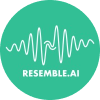

---
nav:
  title: AI 导航
  order: -1
group:
  title: AI 导航
  order: 0
---

# 音频工具

<List>
  <a href="HTTPS://tianyin.163.com/" style="display:flex; align-items:center;">
    
    

      
网易天音

      
网易推出的一站式AI音乐创作工具

    

  </a>
  <a href="HTTPS://y.qq.com/tme_studio/index.HTML#/" style="display:flex; align-items:center;">
    
    

      
TME Studio

      
腾讯音乐推出的智能音乐创作助手

    

  </a>
  <a href="HTTPS://www.stableaudio.com/" style="display:flex; align-items:center;">
    
    

      
Stable Audio

      
Stability AI最新推出的音乐生成工具

    

  </a>
  <a href="HTTPS://www.riffusion.com/" style="display:flex; align-items:center;">
    
    

      
Riffusion

      
AI生成不同风格的音乐，免费开源

    

  </a>
  <a href="HTTPS://peiyin.xunfei.cn/" style="display:flex; align-items:center;">
    
    

      
讯飞智作

      
科大讯飞推出的AI转语音和配音工具

    

  </a>
  <a href="HTTPS://uberduck.ai/" style="display:flex; align-items:center;">
    
    

      
Uberduck

      
开源的AI语音生成社区，5000多种不同的声音

    

  </a>
  <a href="HTTPS://podcast.adobe.com/" style="display:flex; align-items:center;">
    
    

      
Adobe Podcast

      
Adobe推出的在线AI音频录制和编辑工具

    

  </a>
  <a href="HTTPS://elevenlabs.io/" style="display:flex; align-items:center;">
    
    

      
ElevenLabs

      
AI文本转语音，支持包含中文在内的28种语言

    

  </a>
  <a href="HTTPS://xstudio.music.163.com/" style="display:flex; align-items:center;">
    
    

      
网易云音乐·X Studio

      
网易云音乐与小冰智能联合推出的免费AI歌手音乐创作软件

    

  </a>
  <a href="HTTPS://ace-studio.timedomain.cn/" style="display:flex; align-items:center;">
    
    

      
ACE Studio

      
AI歌声合成工具，输入歌词与旋律即可生成宛如真人的歌声

    

  </a>
  <a href="HTTPS://www.resemble.ai/" style="display:flex; align-items:center;">
    
    

      
Resemble.ai

      
AI人声生成工具

    

  </a>
  <a href="HTTPS://www.ibm.com/cloud/watson-text-to-speech" style="display:flex; align-items:center;">
    
    

      
IBM Watson文字转语音

      
IBM Watson文字转语音

    

  </a>
  <a href="HTTPS://fakeyou.com/" style="display:flex; align-items:center;">
    
    

      
FakeYou

      
Deep Fake文本转语音

    

  </a>
  <a href="HTTPS://www.moyin.com/" style="display:flex; align-items:center;">
    
    

      
魔音工坊

      
短视频/有声书AI配音平台，由出门问问推出

    

  </a>
  <a href="HTTPS://bgmcat.com/home" style="display:flex; align-items:center;">
    
    

      
BGM猫

      
灵动音科技推出的AI智能生成BGM音乐

    

  </a>
  <a href="HTTPS://yueyin.zhipianbang.com/" style="display:flex; align-items:center;">
    
    

      
悦音配音

      
AI智能在线配音语音合成工具

    

  </a>
  <a href="HTTPS://mubert.com/" style="display:flex; align-items:center;">
    
    

      
Mubert

      
AI BGM背景音乐生成工具

    

  </a>
  <a href="HTTPS://www.beatoven.ai/" style="display:flex; align-items:center;">
    
    

      
Beatoven.ai

      
免版税AI音乐创建平台

    

  </a>
  <a href="HTTPS://beatbot.fm/" style="display:flex; align-items:center;">
    
    

      
BeatBot

      
输入文本提示快速生成歌曲和音乐

    

  </a>
  <a href="HTTPS://audo.ai/" style="display:flex; align-items:center;">
    
    

      
Audo Studio

      
AI音频清洗工具（噪音消除、声音平衡、音量调节）

    

  </a>
  <a href="HTTPS://www.naturalreaders.com/" style="display:flex; align-items:center;">
    
    

      
NaturalReader

      
AI文本转语音工具

    

  </a>
  <a href="HTTPS://www.assemblyai.com/" style="display:flex; align-items:center;">
    
    

      
AssemblyAI

      
转录和理解语音的AI模型

    

  </a>
  <a href="HTTPS://www.lalal.ai/" style="display:flex; align-items:center;">
    
    

      
LALAL.AI

      
AI人声乐器分离和提取

    

  </a>
  <a href="HTTPS://krisp.ai/" style="display:flex; align-items:center;">
    
    

      
Krisp

      
AI噪音消除工具

    

  </a>
  <a href="HTTPS://play.ht/" style="display:flex; align-items:center;">
    
    

      
Play.ht

      
超真实在线AI语音生成

    

  </a>
  <a href="HTTPS://murf.ai/" style="display:flex; align-items:center;">
    
    

      
Murf AI

      
AI文本转语音生成工具

    

  </a>
  <a href="HTTPS://lemonaid.ai/" style="display:flex; align-items:center;">
    
    

      
Lemonaid

      
AI音乐生成工具

    

  </a>
  <a href="HTTPS://soundraw.io/" style="display:flex; align-items:center;">
    
    

      
Soundraw

      
AI音乐生成工具

    

  </a>
  <a href="HTTPS://boomy.com/" style="display:flex; align-items:center;">
    
    

      
Boomy

      
AI快速生成原创音乐的平台

    

  </a>
  <a href="HTTPS://lovo.ai/" style="display:flex; align-items:center;">
    
    

      
LOVO AI

      
AI人声和文本转语音生成工具

    

  </a>
  <a href="HTTPS://typecast.ai/" style="display:flex; align-items:center;">
    
    

      
Typecast

      
在线AI文字转语音生成工具

    

  </a>
  <a href="HTTPS://www.veed.io/tools/text-to-speech-video/ai-voice-generator" style="display:flex; align-items:center;">
    
    

      
Veed AI Voice Generator

      
Veed推出的AI语音生成器

    

  </a>
  <a href="HTTPS://clipchamp.com/zh-hans/features/ai-voice-over-generator/" style="display:flex; align-items:center;">
    
    

      
Clipchamp AI旁白生成器

      
Clipchamp的文字转语音生成器

    

  </a>
  <a href="HTTPS://themetavoice.xyz/" style="display:flex; align-items:center;">
    
    

      
MetaVoice

      
AI实时变声工具

    

  </a>
  <a href="HTTPS://speechify.com/zh-hans/" style="display:flex; align-items:center;">
    
    

      
Speechify

      
超2000万人都在用的文字转语音朗读器

    

  </a>
  <a href="HTTPS://voicemaker.in/" style="display:flex; align-items:center;">
    
    

      
Voicemaker

      
AI文本到语音生成工具

    

  </a>
  <a href="HTTPS://voice.ai/" style="display:flex; align-items:center;">
    
    

      
Voice.ai

      
实时AI变声工具

    

  </a>
  <a href="HTTPS://www.listnr.tech/" style="display:flex; align-items:center;">
    
    

      
Listnr

      
AI文本到语音生成器

    

  </a>
  <a href="HTTPS://www.voicemod.net/ai-voices/" style="display:flex; align-items:center;">
    
    

      
Voicemod

      
AI变声工具

    

  </a>
  <a href="HTTPS://wellsaidlabs.com/" style="display:flex; align-items:center;">
    
    

      
WellSaid Labs

      
AI文本转语音工具

    

  </a>
  <a href="HTTPS://www.notta.ai/en" style="display:flex; align-items:center;">
    
    

      
Notta

      
AI在线将语音转换成文字

    

  </a>
  <a href="HTTPS://tingwu.aliyun.com/" style="display:flex; align-items:center;">
    
    

      
通义听悟

      
阿里推出的AI会议转录工具，万语千言，心领神悟

    

  </a>
</List>
