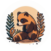
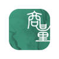

---
nav:
  title: AI 导航
  order: -1
group:
  title: AI 导航
  order: 0
---

# 对话工具

<List>
  <a href="https://cn.bing.com/search?q=ChatGPT&ensearch=1" style="display:flex; align-items:center;">
    
    

      
ChatGPT

      
OpenAI旗下AI对话工具

    

  </a>
  <a href="https://cn.bing.com/search?q=Bing%E6%96%B0%E5%BF%85%E5%BA%94&ensearch=1" style="display:flex; align-items:center;">
    
    

      
Bing新必应

      
微软推出的新版结合了ChatGPT功能的必应

    

  </a>
  <a href="https://workspace.dingtalk.com/welcome" style="display:flex; align-items:center;">
    
    

      
钉钉·个人版

      
钉钉推出的个人版办公应用程序，内置AI智能助手，可进行AI创作、AI对话、AI绘画

    

  </a>
  <a href="https://yiyan.baidu.com/" style="display:flex; align-items:center;">
    
    

      
文心一言

      
百度推出的基于文心大模型的AI对话互动工具

    

  </a>
  <a href="https://cn.bing.com/search?q=Google%20Bard&ensearch=1" style="display:flex; align-items:center;">
    
    

      
Google Bard

      
Google推出的AI聊天对话机器人Bard

    

  </a>
  <a href="https://cn.bing.com/search?q=Claude&ensearch=1" style="display:flex; align-items:center;">
    
    

      
Claude

      
ChatGPT的最为有力的竞争对手之一

    

  </a>
  <a href="https://www.doubao.com/" style="display:flex; align-items:center;">
    
    

      
豆包

      
字节跳动最新推出的免费AI对话助手

    

  </a>
  <a href="https://wukong.com/tool" style="display:flex; align-items:center;">
    
    

      
小悟空

      
字节跳动推出的免费AI对话助手和个人助理

    

  </a>
  <a href="https://qianwen.aliyun.com/" style="display:flex; align-items:center;">
    
    

      
通义千问

      
阿里巴巴推出的类ChatGPT响应人类指令的大模型，已免费开放

    

  </a>
  <a href="https://chatglm.cn/pureDisplay" style="display:flex; align-items:center;">
    
    

      
智谱清言

      
智谱AI推出的生成式AI助手，基于ChatGLM 2

    

  </a>
  <a href="https://yingshi-ai.com/" style="display:flex; align-items:center;">
    
    

      
应事AI

      
MiniMax推出的AI对话助理，已免费开放

    

  </a>
  <a href="https://chat.baichuan-ai.com/home" style="display:flex; align-items:center;">
    
    

      
百川大模型

      
百川智能推出的大模型助手，融合了意图理解、信息检索以及强化学习技术

    

  </a>
  <a href="https://chat.baidu.com/" style="display:flex; align-items:center;">
    
    

      
百度AI伙伴

      
百度最新上线的AI搜索对话工具

    

  </a>
  <a href="https://luca-beta.modelbest.cn/" style="display:flex; align-items:center;">
    
    

      
Luca面壁露卡

      
面壁智能推出的千亿多模态大模型免费智能对话助手

    

  </a>
  <a href="https://www.modelscope.cn/studios/damo/ModelScopeGPT" style="display:flex; align-items:center;">
    
    

      
魔搭GPT（ModelScopeGPT）

      
阿里达摩院推出的大小模型协同的智能助手，具备作诗、绘画、视频生成、语音播放等多模态能力

    

  </a>
  <a href="https://cn.bing.com/search?q=Forefront&ensearch=1" style="display:flex; align-items:center;">
    
    

      
Forefront

      
提供GPT-3.5、GPT-4、Claude的AI聊天机器人

    

  </a>
  <a href="https://cn.bing.com/search?q=HuggingChat&ensearch=1" style="display:flex; align-items:center;">
    
    

      
HuggingChat

      
HuggingFace推出的在线聊天机器人，基于Open Assistant模型

    

  </a>
  <a href="https://cn.bing.com/search?q=Poe&ensearch=1" style="display:flex; align-items:center;">
    
    

      
Poe

      
问答社区Quora推出的问答机器人工具

    

  </a>
  <a href="https://tigerbot.com/" style="display:flex; align-items:center;">
    
    

      
TigerBot

      
虎博科技推出的AI对话聊天机器人，基于TigerBot开源大模型

    

  </a>
  <a href="https://research.stability.ai/chat" style="display:flex; align-items:center;">
    
    

      
Stable Chat

      
Stability AI 最新推出的免费聊天对话网站

    

  </a>
  <a href="https://cn.bing.com/search?q=ColossalChat&ensearch=1" style="display:flex; align-items:center;">
    
    

      
ColossalChat

      
Colossal-AI推出的免费开源版ChatGPT聊天机器人替代品

    

  </a>
  <a href="https://cn.bing.com/search?q=Character.AI&ensearch=1" style="display:flex; align-items:center;">
    
    

      
Character.AI

      
创建虚拟角色并与其对话

    

  </a>
  <a href="https://cn.bing.com/search?q=Jasper%20Chat&ensearch=1" style="display:flex; align-items:center;">
    
    

      
Jasper Chat

      
Jasper针对内容创作者出品的AI聊天工具

    

  </a>
  <a href="https://cn.bing.com/search?q=YouChat%20AI&ensearch=1" style="display:flex; align-items:center;">
    
    

      
YouChat AI

      
AI搜索对话工具

    

  </a>
  <a href="https://cn.bing.com/search?q=ChatSonic&ensearch=1" style="display:flex; align-items:center;">
    
    

      
ChatSonic

      
WriteSonic出品的ChatGPT竞品

    

  </a>
  <a href="https://cn.bing.com/search?q=Replika&ensearch=1" style="display:flex; align-items:center;">
    
    

      
Replika

      
AI对话陪伴工具

    

  </a>
  <a href="https://cn.bing.com/search?q=Whispr&ensearch=1" style="display:flex; align-items:center;">
    
    

      
Whispr

      
免费AI对话回应

    

  </a>
  <a href="https://cn.bing.com/search?q=Open%20Assistant&ensearch=1" style="display:flex; align-items:center;">
    
    

      
Open Assistant

      
免费开源的对话式AI，GitHub星标超3万

    

  </a>
  <a href="https://cn.bing.com/search?q=Pi&ensearch=1" style="display:flex; align-items:center;">
    
    

      
Pi

      
DeepMind联创新公司推出的AI聊天机器人

    

  </a>
  <a href="https://cn.bing.com/search?q=Inworld&ensearch=1" style="display:flex; align-items:center;">
    
    

      
Inworld

      
开发和创建AI虚拟角色并与其互动

    

  </a>
  <a href="https://ai.360.com/" style="display:flex; align-items:center;">
    
    

      
360智脑

      
360搜索最新推出的AI对话聊天机器人

    

  </a>
  <a href="https://cn.bing.com/search?q=Neeva&ensearch=1" style="display:flex; align-items:center;">
    
    

      
Neeva

      
集成了AI问答的AI搜索引擎

    

  </a>
  <a href="https://moss.fastnlp.top/" style="display:flex; align-items:center;">
    
    

      
MOSS

      
复旦大学团队开发的对话式大型语言模型

    

  </a>
  <a href="http://xinghuo.xfyun.cn/" style="display:flex; align-items:center;">
    
    

      
讯飞星火认知大模型

      
科大讯飞推出的类ChatGPT的讯飞星火认知大模型

    

  </a>
  <a href="https://chat.sensetime.com/wb/" style="display:flex; align-items:center;">
    
    

      
商量SenseChat

      
商汤科技推出的类ChatGPT的人工智能大语言模型

    

  </a>
  <a href="https://tiangong.kunlun.com/" style="display:flex; align-items:center;">
    
    

      
天工AI助手

      
昆仑万维与奇点智源联合研发的对标ChatGPT的大语言模型

    

  </a>
  <a href="https://xiezuocat.com/chat" style="display:flex; align-items:center;">
    
    

      
对话写作猫

      
秘塔写作猫推出的AI对话聊天工具

    

  </a>
</List>
