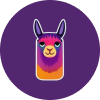
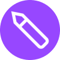

---
nav:
  title: AI 导航
  order: -1
group:
  title: AI 导航
  order: 0
---

# 设计工具

<List>
  <a href="https://www.gaoding.com/utms/a2eab57fc69444d2835e8d7dae8bc1ad" style="display:flex; align-items:center;">
    
    

      
稿定AI

      
一站式AI创意工具集合，AI绘图、场景生成，商品合成

    

  </a>
  <a href="https://jsai.cc/ai/create" style="display:flex; align-items:center;">
    
    

      
即时AI

      
即时设计推出的由文本描述生成可编辑的原型设计稿

    

  </a>
  <a href="https://kebuxi.datasink.sensorsdata.cn/r/dF" style="display:flex; align-items:center;">
    
    

      
Fabrie AI

      
在线白板协作平台Fabrie推出的AI设计助手，支持多种渲染模式

    

  </a>
  <a href="https://designer.microsoft.com/" style="display:flex; align-items:center;">
    
    

      
Microsoft Designer

      
微软推出的在线设计海报和宣传图工具

    

  </a>
  <a href="https://www.canva.com/magic-design/" style="display:flex; align-items:center;">
    
    

      
Magic Design

      
在线设计工具Canva推出的AI设计工具

    

  </a>
  <a href="https://www.x-design.com/" style="display:flex; align-items:center;">
    
    

      
美图设计室

      
AI图像创作和设计平台

    

  </a>
  <a href="https://taishan.qq.com/brand/" style="display:flex; align-items:center;">
    
    

      
智绘设计

      
腾讯推出的智能设计平台，让内容更精彩

    

  </a>
  <a href="https://ai-bot.cn/" style="display:flex; align-items:center;">
    
    

      
阿里云智能logo设计

      
阿里云推出的智能Logo设计

    

  </a>
  <a href="https://ailogo.qq.com/guide/brandname" style="display:flex; align-items:center;">
    
    

      
AIDesign

      
腾讯推出的免费AI Logo在线设计工具

    

  </a>
  <a href="https://looka.com/" style="display:flex; align-items:center;">
    
    

      
Looka

      
AI在线设计和生成logo

    

  </a>
  <a href="https://luban.aliyun.com/" style="display:flex; align-items:center;">
    
    

      
鹿班

      
阿里推出的智能设计商品图和海报的平台

    

  </a>
  <a href="https://ling.jd.com/" style="display:flex; align-items:center;">
    
    

      
羚珑

      
京东推出的商品图智能设计小工具

    

  </a>
  <a href="https://modao.cc/feature/ai.html" style="display:flex; align-items:center;">
    
    

      
墨刀AI

      
墨刀推出的AI产品原型设计助手

    

  </a>
  <a href="https://www.recraft.ai/" style="display:flex; align-items:center;">
    
    

      
Recraft AI

      
免费无限AI画板，生成高质量矢量艺术画、图标、3D图片和插画

    

  </a>
  <a href="https://pixso.cn/" style="display:flex; align-items:center;">
    
    

      
Pixso AI

      
国产在线设计工具Pixso的内置AI助手，支持AI文生图、AI对话、AI设计等

    

  </a>
  <a href="https://www.framer.com/ai" style="display:flex; align-items:center;">
    
    

      
Framer AI

      
Framer推出的AI网站自动设计、生成和上线

    

  </a>
  <a href="https://mastergo.com/upcoming-ai/apply" style="display:flex; align-items:center;">
    
    

      
MasterGo AI

      
国产产品设计工具MasterGo推出的智能UI设计助手

    

  </a>
  <a href="https://motiff.com/" style="display:flex; align-items:center;">
    
    

      
Motiff

      
猿辅导旗下公司推出的AI设计工具

    

  </a>
  <a href="https://logolivery.ai/" style="display:flex; align-items:center;">
    
    

      
LogoliveryAI

      
免费的AI Logo生成器，提供SVG矢量格式

    

  </a>
  <a href="https://www.realibox.com/product/ai" style="display:flex; align-items:center;">
    
    

      
Realibox AI

      
AI免费将草图/模型生成3D渲染图

    

  </a>
  <a href="https://vectorizer.ai/" style="display:flex; align-items:center;">
    
    

      
Vectorizer.AI

      
AI一键将位图转换为矢量图片

    

  </a>
  <a href="https://www.modaiyun.com/mdy/ai" style="display:flex; align-items:center;">
    
    

      
模袋云AI

      
建筑AI创作平台，专注于大型建筑、小型住宅、室内设计、景观的出图和AI模型训练

    

  </a>
  <a href="https://www.vizcom.ai/" style="display:flex; align-items:center;">
    
    

      
Vizcom

      
AI渲染转化手绘图为产品设计图

    

  </a>
  <a href="https://www.dora.run/ai" style="display:flex; align-items:center;">
    
    

      
Dora AI

      
AI在线生成精美3D动画的网站

    

  </a>
  <a href="https://designs.ai/" style="display:flex; align-items:center;">
    
    

      
Designs.ai

      
AI设计工具

    

  </a>
  <a href="https://www.usegalileo.ai/" style="display:flex; align-items:center;">
    
    

      
Galileo AI

      
AI高保真原型设计

    

  </a>
  <a href="https://spline.design/ai" style="display:flex; align-items:center;">
    
    

      
Spline AI

      
Spline推出的AI生成3D物体、动画、材质

    

  </a>
  <a href="https://www.illostration.com/" style="display:flex; align-items:center;">
    
    

      
illostrationAI

      
AI插画生成，low poly、3D、矢量、logo、像素风、皮克斯等风格

    

  </a>
  <a href="https://uizard.io/ai-design/" style="display:flex; align-items:center;">
    
    

      
Uizard

      
AI网页、App和UI设计

    

  </a>
  <a href="https://lumalabs.ai/" style="display:flex; align-items:center;">
    
    

      
Luma AI

      
AI 3D捕捉、建模和渲染

    

  </a>
  <a href="https://www.nolibox.com/introduction" style="display:flex; align-items:center;">
    
    

      
图宇宙

      
高品质AI智能设计平台

    

  </a>
  <a href="https://www.meijian.com/" style="display:flex; align-items:center;">
    
    

      
美间

      
AI软装设计、海报和提案生成工具

    

  </a>
  <a href="https://withpoly.com/browse/textures" style="display:flex; align-items:center;">
    
    

      
Poly

      
AI生成3D材质

    

  </a>
  <a href="https://illustroke.com/" style="display:flex; align-items:center;">
    
    

      
Illustroke

      
AI SVG矢量插画生成工具

    

  </a>
  <a href="https://colors.eva.design/" style="display:flex; align-items:center;">
    
    

      
Eva Design System

      
基于深度学习的色彩生成工具

    

  </a>
  <a href="https://brandmark.io/color-wheel/" style="display:flex; align-items:center;">
    
    

      
Color Wheel

      
AI灰度logo或插画上色工具

    

  </a>
  <a href="https://huemint.com/" style="display:flex; align-items:center;">
    
    

      
Huemint

      
AI调色生成工具

    

  </a>
  <a href="https://www.obviously.ai/" style="display:flex; align-items:center;">
    
    

      
ColorMagic

      
AI调色板生成工具

    

  </a>
  <a href="https://logomaster.ai/" style="display:flex; align-items:center;">
    
    

      
Logomaster.ai

      
AI Logo生成工具

    

  </a>
  <a href="https://magician.design/" style="display:flex; align-items:center;">
    
    

      
Magician

      
Figma插件，AI生成图标、图片和UX文案

    

  </a>
  <a href="https://appicons.ai/" style="display:flex; align-items:center;">
    
    

      
Appicons AI

      
AI生成精美App图标

    

  </a>
  <a href="https://www.iconifyai.com/" style="display:flex; align-items:center;">
    
    

      
IconifyAI

      
AI App图标生成器

    

  </a>
  <a href="https://www.khroma.co/" style="display:flex; align-items:center;">
    
    

      
Khroma

      
AI调色盘生成工具

    

  </a>
  <a href="https://www.getalpaca.io/" style="display:flex; align-items:center;">
    
    

      
Alpaca

      
将生成式AI集成到Photoshop图像设计中

    

  </a>
  <a href="https://www.figma.com/community/widget/1274481464484630971" style="display:flex; align-items:center;">
    
    

      
Jambot

      
Figma团队推出的FigJam AI白板插件，可快速进行头脑风暴、思维导图生成等

    

  </a>
</List>
