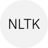

---
nav:
  title: AI 导航
  order: -1
group:
  title: AI 导航
  order: 0
---

# 开发框架

<List>
  <a href="https://www.tensorflow.org/" style="display:flex; align-items:center;">
    
    

      
TensorFlow

      
Google推出的机器学习和人工智能开源库

    

  </a>
  <a href="https://pytorch.org/" style="display:flex; align-items:center;">
    
    

      
PyTorch

      
开源机器学习框架

    

  </a>
  <a href="https://www.paddlepaddle.org.cn/" style="display:flex; align-items:center;">
    
    

      
飞桨PaddlePaddle

      
开源深度学习平台

    

  </a>
  <a href="https://www.mindspore.cn/" style="display:flex; align-items:center;">
    
    

      
昇思MindSpore

      
华为开源自研AI深度学习框架

    

  </a>
  <a href="https://mxnet.apache.org/" style="display:flex; align-items:center;">
    
    

      
Apache MXNet

      
免费开源的深度学习框架

    

  </a>
  <a href="https://scikit-learn.org/" style="display:flex; align-items:center;">
    
    

      
Scikit-learn

      
Python机器学习库

    

  </a>
  <a href="https://labelstud.io/" style="display:flex; align-items:center;">
    
    

      
Label Studio

      
免费开源的数据标注工具

    

  </a>
  <a href="https://sdk.vercel.ai/docs" style="display:flex; align-items:center;">
    
    

      
Vercel AI SDK

      
Vercel开源的搭建AI聊天机器人的开发套件，支持React/Svelte/Vue等框架

    

  </a>
  <a href="https://keras.io/" style="display:flex; align-items:center;">
    
    

      
Keras

      
Python版本的TensorFlow深度学习API

    

  </a>
  <a href="https://caffe.berkeleyvision.org/" style="display:flex; align-items:center;">
    
    

      
Caffe

      
UC伯克利研究推出的深度学习框架

    

  </a>
  <a href="https://numpy.org/" style="display:flex; align-items:center;">
    
    

      
NumPy

      
Python科学计算必备的包

    

  </a>
  <a href="https://deeplearning4j.konduit.ai/" style="display:flex; align-items:center;">
    
    

      
DL4J

      
开源的使用JVM部署和训练深度学习模型的套件

    

  </a>
  <a href="https://jax.readthedocs.io/en/latest/" style="display:flex; align-items:center;">
    
    

      
JAX

      
Google推出的用于变换数值函数的机器学习框架

    

  </a>
  <a href="https://www.nltk.org/" style="display:flex; align-items:center;">
    
    

      
NLTK

      
Python自然语言处理工具包

    

  </a>
  <a href="https://docs.langchain.com/docs/" style="display:flex; align-items:center;">
    
    

      
LangChain

      
开发由语言模型驱动的应用程序的框架

    

  </a>
  <a href="https://lightning.ai/" style="display:flex; align-items:center;">
    
    

      
Lightning AI

      
快速训练、部署和开发人工智能产品的深度学习框架，由Pytorch Lightning团队推出

    

  </a>
  <a href="https://www.tryleap.ai/" style="display:flex; align-items:center;">
    
    

      
Leap

      
将AI快速集成到你自己的应用中

    

  </a>
</List>
