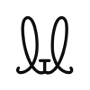

---
nav:
  title: AI 导航
  order: -1
group:
  title: 图像工具
  order: 1
---

# 图片背景移除

<List>
  <a href="https://d.design/toolbox/cutout" style="display:flex; align-items:center;">
    
    

      
顽兔抠图

      
阿里推出的一键去除商品图背景工具

    

  </a>
  <a href="https://icons8.com/bgremover" style="display:flex; align-items:center;">
    
    

      
Icons8 Background Remover

      
Icons8出品的免费图片背景移除工具

    

  </a>
  <a href="https://clipdrop.co/remove-background" style="display:flex; align-items:center;">
    
    

      
ClipDrop Remove Background

      
ClipDrop出品的AI图片背景移除工具

    

  </a>
  <a href="https://www.erase.bg/zh" style="display:flex; align-items:center;">
    
    

      
Erase.bg

      
在线抠图和去除图片背景

    

  </a>
  <a href="https://bgsub.cn/" style="display:flex; align-items:center;">
    
    

      
BgSub

      
免费的保护隐私的AI图片背景去除工具

    

  </a>
  <a href="https://icons8.com/goprod" style="display:flex; align-items:center;">
    
    

      
GoProd

      
Icons8推出的智能图片背景移除和无损放大二合一Mac应用

    

  </a>
  <a href="https://www.adobe.com/express/feature/image/remove-background" style="display:flex; align-items:center;">
    
    

      
Adobe Image Background Remover

      
Adobe Express的图片背景移除工具

    

  </a>
  <a href="https://www.remove.bg/zh" style="display:flex; align-items:center;">
    
    

      
remove.bg

      
强大的AI背景移除工具

    

  </a>
  <a href="https://removal.ai/" style="display:flex; align-items:center;">
    
    

      
Removal.AI

      
AI图片背景移除工具

    

  </a>
  <a href="https://magicstudio.com/zh/backgrounderaser" style="display:flex; align-items:center;">
    
    

      
Background Eraser

      
AI自动删除图片背景

    

  </a>
  <a href="https://www.slazzer.com/" style="display:flex; align-items:center;">
    
    

      
Slazzer

      
免费在线抠除图片背景

    

  </a>
  <a href="https://www.cutout.pro/zh-cn/remove-background" style="display:flex; align-items:center;">
    
    

      
Cutout.Pro抠图

      
AI批量抠图去背景

    

  </a>
  <a href="https://bgremover.vanceai.com/" style="display:flex; align-items:center;">
    
    

      
BGremover

      
Vance AI推出的图片背景移除工具

    

  </a>
  <a href="https://tools.picsart.com/image/background-remover/" style="display:flex; align-items:center;">
    
    

      
Quicktools Background Remover

      
Picsart旗下的Quicktools推出的图片背景移除工具

    

  </a>
  <a href="https://zyro.com/tools/image-background-remover" style="display:flex; align-items:center;">
    
    

      
Zyro AI Background Remover

      
Zyro推出的AI图片背景移除工具

    

  </a>
  <a href="https://photoscissors.com/" style="display:flex; align-items:center;">
    
    

      
PhotoScissors

      
免费自动图片背景去除

    

  </a>
  <a href="https://www.yijiankoutu.com/" style="display:flex; align-items:center;">
    
    

      
一键抠图

      
在线一键抠图换背景

    

  </a>
  <a href="https://clippingmagic.com/" style="display:flex; align-items:center;">
    
    

      
ClippingMagic

      
魔术般地去除图片背景

    

  </a>
  <a href="https://www.tukeli.net/" style="display:flex; align-items:center;">
    
    

      
图可丽

      
AI图片和视频抠图，一键抠图神器

    

  </a>
  <a href="https://hotpot.ai/remove-background" style="display:flex; align-items:center;">
    
    

      
Hotpot AI Background Remover

      
Hotpot.ai推出的图片背景移除工具

    

  </a>
  <a href="https://www.stylized.ai/" style="display:flex; align-items:center;">
    
    

      
Stylized

      
AI产品图背景替换

    

  </a>
  <a href="https://pebblely.com/" style="display:flex; align-items:center;">
    
    

      
Pebblely

      
AI产品图精美背景添加

    

  </a>
  <a href="https://mokker.ai/" style="display:flex; align-items:center;">
    
    

      
Mokker AI

      
AI产品图添加背景

    

  </a>
  <a href="https://www.booth.ai/" style="display:flex; align-items:center;">
    
    

      
Booth.ai

      
高质量AI产品展示效果图生成

    

  </a>
  <a href="https://www.pixelcut.ai/" style="display:flex; align-items:center;">
    
    

      
Pixelcut.ai

      
AI产品背景移除和替换

    

  </a>
  <a href="https://picwish.com/" style="display:flex; align-items:center;">
    
    

      
PicWish

      
AI图片编辑和背景移除

    

  </a>
  <a href="https://koutu.gaoding.com/utms/e3717a090a6a42c180e2c273dcf8eed8" style="display:flex; align-items:center;">
    
    

      
稿定抠图

      
稿定设计推出的AI自动消除背景工具

    

  </a>
  <a href="https://www.photoroom.com/background-remover" style="display:flex; align-items:center;">
    
    

      
PhotoRoom

      
免费的AI图片背景移除和添加

    

  </a>
  <a href="https://cutout.meitu.com/" style="display:flex; align-items:center;">
    
    

      
美图抠图

      
美图秀秀推出的AI智能抠图工具，一键移除背景

    

  </a>
</List>
