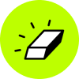
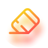

---
nav:
  title: AI 导航
  order: -1
group:
  title: 图像工具
  order: 1
---

# 图片物体抹除

<List>
  <a href="https://www.hama.app/zh" style="display:flex; align-items:center;">
    
    

      
Hama

      
在线抹除图片中不想要的物体

    

  </a>
  <a href="https://bgeraser.com/" style="display:flex; align-items:center;">
    
    

      
Bg Eraser

      
图片物体抹除和清理

    

  </a>
  <a href="https://snapedit.app/" style="display:flex; align-items:center;">
    
    

      
SnapEdit

      
AI移除图片中的任何物体

    

  </a>
  <a href="https://cleanup.pictures/" style="display:flex; align-items:center;">
    
    

      
Cleanup.pictures

      
智能移除图片中的物体、文本、污迹、人物或任何不想要的东西

    

  </a>
  <a href="https://www.cutout.pro/zh-CN/image-retouch-remove-unwanted-objects" style="display:flex; align-items:center;">
    
    

      
Cutout.Pro Retouch

      
Cutout.Pro推出的AI图片物体涂抹去除工具

    

  </a>
  <a href="https://magicstudio.com/zh/magiceraser" style="display:flex; align-items:center;">
    
    

      
Magic Eraser

      
AI移除图片中不想要的物体

    

  </a>
  <a href="https://www.watermarkremover.io/zh" style="display:flex; align-items:center;">
    
    

      
WatermarkRemover

      
AI智能删除照片中的水印

    

  </a>
</List>
