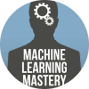

---
nav:
  title: AI 导航
  order: -1
group:
  title: AI 导航
  order: 0
---

# 学习网站

<List>
  <a href="https://www.fast.ai/" style="display:flex; align-items:center;">
    
    

      
fast.ai

      
免费开源的深度学习和AI学习网站，让每个人都参与到AI！

    

  </a>
  <a href="https://www.coursera.org/collections/best-machine-learning-ai" style="display:flex; align-items:center;">
    
    

      
Coursera

      
知名MOOC平台，众多人工智能和机器学习课程

    

  </a>
  <a href="https://www.elementsofai.com/" style="display:flex; align-items:center;">
    
    

      
Elements of AI

      
免费在线AI通识学习

    

  </a>
  <a href="https://www.deeplearning.ai/" style="display:flex; align-items:center;">
    
    

      
DeepLearning.AI

      
深度学习和人工智能学习平台

    

  </a>
  <a href="https://zh.d2l.ai/" style="display:flex; align-items:center;">
    
    

      
动手学深度学习

      
动手学深度学习的教材和课程

    

  </a>
  <a href="https://machinelearningmastery.com/start-here/" style="display:flex; align-items:center;">
    
    

      
MachineLearningMastery

      
免费在线学习机器学习，从基础到高级

    

  </a>
  <a href="https://microsoft.github.io/ML-For-Beginners/" style="display:flex; align-items:center;">
    
    

      
ML for Beginners

      
微软推出的免费开源的机器学习课程，GitHub标星4万+

    

  </a>
  <a href="https://www.kaggle.com/" style="display:flex; align-items:center;">
    
    

      
Kaggle

      
机器学习和数据科学社区

    

  </a>
  <a href="https://brilliant.org/courses/intro-neural-networks/" style="display:flex; align-items:center;">
    
    

      
神经网络入门

      
Brilliant推出的Introduction to Neural Networks课程

    

  </a>
  <a href="https://aistudio.baidu.com/" style="display:flex; align-items:center;">
    
    

      
飞桨AI Studio

      
人工智能学习实训社区

    

  </a>
  <a href="https://www.aidaxue.com/" style="display:flex; align-items:center;">
    
    

      
AI大学堂

      
科大讯飞推出的AI大学堂，学习AI、走进未来

    

  </a>
  <a href="https://developer.aliyun.com/learning/roadmap/ai" style="display:flex; align-items:center;">
    
    

      
阿里云AI学习路线

      
阿里云推出的人工智能学习路线（学+测）

    

  </a>
  <a href="https://www.udacity.com/school/school-of-ai" style="display:flex; align-items:center;">
    
    

      
Udacity AI学院

      
Udacity推出的School of AI，从入门到高级

    

  </a>
  <a href="https://ai.google/" style="display:flex; align-items:center;">
    
    

      
Google AI

      
Google AI学习平台

    

  </a>
  <a href="https://www.showmeai.tech/" style="display:flex; align-items:center;">
    
    

      
ShowMeAI知识社区

      
人工智能领域的资料库和学习社区

    

  </a>
</List>
