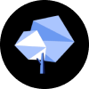

---
nav:
  title: AI 导航
  order: -1
group:
  title: 图像工具
  order: 1
---

# 图片插画生成

<List>
  <a href="https://cn.bing.com/search?q=Midjourney&ensearch=1" style="display:flex; align-items:center;">
    
    

      
Midjourney

      
AI图像和插画生成工具

    

  </a>
  <a href="https://cn.bing.com/search?q=Stable%20Diffusion&ensearch=1" style="display:flex; align-items:center;">
    
    

      
Stable Diffusion

      
StabilityAI推出的文本到图像生成AI

    

  </a>
  <a href="https://cn.bing.com/create" style="display:flex; align-items:center;">
    
    

      
Bing Image Creator

      
微软必应推出的基于DALL·E的AI图像生成工具

    

  </a>
  <a href="https://yige.baidu.com/" style="display:flex; align-items:center;">
    
    

      
文心一格

      
AI艺术和创意辅助平台

    

  </a>
  <a href="https://wanxiang.aliyun.com/" style="display:flex; align-items:center;">
    
    

      
通义万相

      
阿里最新推出的AI绘画创作模型

    

  </a>
  <a href="https://www.printidea.art/" style="display:flex; align-items:center;">
    
    

      
造梦日记

      
AI一下，妙笔生画

    

  </a>
  <a href="https://design.meitu.com/aigc/text-to-image" style="display:flex; align-items:center;">
    
    

      
美图AI文生图

      
美图推出的AI文本生成图片的工具

    

  </a>
  <a href="https://miaohua.sensetime.com/zh-CN" style="display:flex; align-items:center;">
    
    

      
秒画

      
商汤科技推出的免费AI作画和图片生成平台

    

  </a>
  <a href="https://ai.sohu.com/search" style="display:flex; align-items:center;">
    
    

      
简单AI

      
搜狐最新推出的AI图片生成平台

    

  </a>
  <a href="http://douchu.ai/warehouse/styleStore" style="display:flex; align-items:center;">
    
    

      
触手AI绘画

      
免费专业的AI绘画/模型/分享平台

    

  </a>
  <a href="https://www.whee.com/" style="display:flex; align-items:center;">
    
    

      
WHEE

      
美图最新推出的AI图片和绘画创作生成平台

    

  </a>
  <a href="https://d.design/ai" style="display:flex; align-items:center;">
    
    

      
堆友AI反应堆

      
阿里旗下堆友推出的多风格AI绘画生成器

    

  </a>
  <a href="https://aiart.chuangkit.com/landingpage" style="display:flex; align-items:center;">
    
    

      
创客贴AI画匠

      
创客贴推出的AI艺术画生成工具

    

  </a>
  <a href="https://ke.study.163.com/artWorks/painting" style="display:flex; align-items:center;">
    
    

      
网易AI创意工坊

      
网易云课堂推出的AI作画平台，在线使用Stable Diffusion出图

    

  </a>
  <a href="https://6pen.art/" style="display:flex; align-items:center;">
    
    

      
6pen Art

      
面包多团队推出的从文本描述生成绘画艺术作品

    

  </a>
  <a href="https://cn.bing.com/search?q=Adobe%20Firefly&ensearch=1" style="display:flex; align-items:center;">
    
    

      
Adobe Firefly

      
Adobe最新推出的AI图片生成工具

    

  </a>
  <a href="https://creator.nolibox.com/" style="display:flex; align-items:center;">
    
    

      
画宇宙

      
人工智能AI作画网站

    

  </a>
  <a href="https://cn.bing.com/search?q=Freepik%20AI%20Image%20Generator&ensearch=1" style="display:flex; align-items:center;">
    
    

      
Freepik AI Image Generator

      
Freepik最新推出的AI图片生成工具

    

  </a>
  <a href="https://cn.bing.com/search?q=Canva%20AI%E5%9B%BE%E5%83%8F%E7%94%9F%E6%88%90&ensearch=1" style="display:flex; align-items:center;">
    
    

      
Canva AI图像生成

      
在线设计工具Canva推出的AI图像生成工具

    

  </a>
  <a href="https://cn.bing.com/search?q=Stockimg%20AI&ensearch=1" style="display:flex; align-items:center;">
    
    

      
Stockimg AI

      
AI生成各种类型的图像和插画

    

  </a>
  <a href="https://clipdrop.co/stable-doodle" style="display:flex; align-items:center;">
    
    

      
Stable Doodle

      
StabilityAI最新推出的将手绘草图转换成精美图像的工具

    

  </a>
  <a href="https://xingzheai.cn/#create?utm_source=ai-bot.cn" style="display:flex; align-items:center;">
    
    

      
行者AI美术

      
AI图片生成和美术创作工具箱

    

  </a>
  <a href="https://www.ishencai.com/" style="display:flex; align-items:center;">
    
    

      
神采

      
让创意照进现实， AI生成创意插画

    

  </a>
  <a href="https://skybox.blockadelabs.com/" style="display:flex; align-items:center;">
    
    

      
Skybox AI

      
AI生成和合成360°全景图像插画

    

  </a>
  <a href="https://sky-paint.singularity-ai.com/index.html#/" style="display:flex; align-items:center;">
    
    

      
天工巧绘SkyPaint

      
免费的AI插画绘制工具，由昆仑万维与奇点智源合作推出

    

  </a>
  <a href="https://flagstudio.baai.ac.cn/" style="display:flex; align-items:center;">
    
    

      
FlagStudio

      
智源研究院推出的AI文本图像绘画生成工具

    

  </a>
  <a href="https://cn.bing.com/search?q=NightCafe&ensearch=1" style="display:flex; align-items:center;">
    
    

      
NightCafe

      
AI艺术插画在线生成

    

  </a>
  <a href="https://cn.bing.com/search?q=niji%E3%83%BBjourney&ensearch=1" style="display:flex; align-items:center;">
    
    

      
niji・journey

      
魔法般的二次元绘画生成

    

  </a>
  <a href="https://cn.bing.com/search?q=Deep%20Dream%20Generator&ensearch=1" style="display:flex; align-items:center;">
    
    

      
Deep Dream Generator

      
AI创建生成梦幻般的插画图片，刻画你的梦中场景

    

  </a>
  <a href="https://588ku.com/ai/wuxianhua/Home" style="display:flex; align-items:center;">
    
    

      
无限画

      
千库网推出的AI图片插画生成工具

    

  </a>
  <a href="https://cn.bing.com/search?q=BlueWillow&ensearch=1" style="display:flex; align-items:center;">
    
    

      
BlueWillow

      
免费的AI图像艺术画生成工具

    

  </a>
  <a href="https://cn.bing.com/search?q=Waifu%20Labs&ensearch=1" style="display:flex; align-items:center;">
    
    

      
Waifu Labs

      
免费在线AI生成二次元动漫头像

    

  </a>
  <a href="https://cn.bing.com/search?q=dreamlike.art&ensearch=1" style="display:flex; align-items:center;">
    
    

      
dreamlike.art

      
免费在线插画生成工具

    

  </a>
  <a href="https://cn.bing.com/search?q=Artbreeder&ensearch=1" style="display:flex; align-items:center;">
    
    

      
Artbreeder

      
创建令人惊叹的插画和艺术

    

  </a>
  <a href="https://www.tiamat.world/" style="display:flex; align-items:center;">
    
    

      
Tiamat

      
国内团队推出的AI艺术画生成工具

    

  </a>
  <a href="https://rightbrain.art/" style="display:flex; align-items:center;">
    
    

      
Vega AI

      
在线免费AI插画创作平台，支持文生图，图生图，条件生图等多种绘画模式

    

  </a>
  <a href="https://cn.bing.com/search?q=Wepik%20AI&ensearch=1" style="display:flex; align-items:center;">
    
    

      
Wepik AI

      
Freepik推出的AI文本到图像的在线生成工具

    

  </a>
  <a href="https://cn.bing.com/search?q=Craiyon&ensearch=1" style="display:flex; align-items:center;">
    
    

      
Craiyon

      
免费在线文本到图像生成

    

  </a>
  <a href="https://aigc.wondershare.cn/" style="display:flex; align-items:center;">
    
    

      
万兴爱画

      
万兴科技推出的AI生成高品质艺术画工具

    

  </a>
  <a href="https://cn.bing.com/search?q=Photosonic&ensearch=1" style="display:flex; align-items:center;">
    
    

      
Photosonic

      
Writesonic推出的AI艺术插画生成工具

    

  </a>
  <a href="https://cn.bing.com/search?q=Astria&ensearch=1" style="display:flex; align-items:center;">
    
    

      
Astria

      
可定制的人工智能图像生成

    

  </a>
  <a href="https://cn.bing.com/search?q=getimg.ai&ensearch=1" style="display:flex; align-items:center;">
    
    

      
getimg.ai

      
在线AI图像和插画创作工具

    

  </a>
  <a href="https://cn.bing.com/search?q=DreamUp&ensearch=1" style="display:flex; align-items:center;">
    
    

      
DreamUp

      
DeviantArt推出的AI插画生成工具

    

  </a>
  <a href="https://cn.bing.com/search?q=Scribble%20Diffusion&ensearch=1" style="display:flex; align-items:center;">
    
    

      
Scribble Diffusion

      
将草图转变为精美的插画

    

  </a>
  <a href="https://cn.bing.com/search?q=Lexica&ensearch=1" style="display:flex; align-items:center;">
    
    

      
Lexica

      
基于Stable Diffusion的在线插画生成

    

  </a>
  <a href="https://cn.bing.com/search?q=Generated%20Photos&ensearch=1" style="display:flex; align-items:center;">
    
    

      
Generated Photos

      
AI人脸头像生成工具

    

  </a>
  <a href="https://cn.bing.com/search?q=Picsart%20AI&ensearch=1" style="display:flex; align-items:center;">
    
    

      
Picsart AI

      
Picsart推出的AI图片生成器

    

  </a>
  <a href="https://cn.bing.com/search?q=Imagine%20by%20Magic%20Studio&ensearch=1" style="display:flex; align-items:center;">
    
    

      
Imagine by Magic Studio

      
AI文字到图片生成

    

  </a>
  <a href="https://cn.bing.com/search?q=neural.love&ensearch=1" style="display:flex; align-items:center;">
    
    

      
neural.love

      
AI艺术图片生成

    

  </a>
  <a href="https://cn.bing.com/search?q=starryai&ensearch=1" style="display:flex; align-items:center;">
    
    

      
starryai

      
AI艺术图片生成

    

  </a>
  <a href="https://cn.bing.com/search?q=Artssy&ensearch=1" style="display:flex; align-items:center;">
    
    

      
Artssy

      
AI图像生成

    

  </a>
  <a href="https://cn.bing.com/search?q=ShutterStock%20AI%E5%9B%BE%E7%89%87%E7%94%9F%E6%88%90&ensearch=1" style="display:flex; align-items:center;">
    
    

      
ShutterStock AI图片生成

      
Shutterstock推出的AI图片生成工具

    

  </a>
  <a href="https://cn.bing.com/search?q=Playform&ensearch=1" style="display:flex; align-items:center;">
    
    

      
Playform

      
专业的高质量AI艺术画生成平台

    

  </a>
  <a href="https://cn.bing.com/search?q=Photo%20Booth%20by%20Magic%20Studio&ensearch=1" style="display:flex; align-items:center;">
    
    

      
Photo Booth by Magic Studio

      
AI创建个人资料图片

    

  </a>
  <a href="https://cn.bing.com/search?q=Supermeme&ensearch=1" style="display:flex; align-items:center;">
    
    

      
Supermeme

      
AI MEME梗图生成器

    

  </a>
  <a href="https://www.fotor.com/features/ai-image-generator/" style="display:flex; align-items:center;">
    
    

      
Fotor

      
Fotor推出的在线AI图片生成工具

    

  </a>
  <a href="https://cn.bing.com/search?q=Dream.ai&ensearch=1" style="display:flex; align-items:center;">
    
    

      
Dream.ai

      
WOMBO推出的AI艺术画生成工具

    

  </a>
  <a href="https://www.wujieai.com/" style="display:flex; align-items:center;">
    
    

      
无界AI

      
AI生成艺术插画和二次元人物

    

  </a>
  <a href="https://www.zcool.com.cn/ailab" style="display:flex; align-items:center;">
    
    

      
站酷梦笔

      
国内知名设计社区站酷推出的人工智能插画生成工具

    

  </a>
  <a href="https://www.gaituya.com/aiimg/" style="display:flex; align-items:center;">
    
    

      
改图鸭AI图片生成

      
改图鸭AI图片生成

    

  </a>
  <a href="https://cn.bing.com/search?q=Prodia&ensearch=1" style="display:flex; align-items:center;">
    
    

      
Prodia

      
AI艺术画生成工具

    

  </a>
  <a href="https://cn.bing.com/search?q=Lucidpic&ensearch=1" style="display:flex; align-items:center;">
    
    

      
Lucidpic

      
AI生成高质量人像照片

    

  </a>
  <a href="https://cn.bing.com/search?q=AI%20Photos&ensearch=1" style="display:flex; align-items:center;">
    
    

      
AI Photos

      
AI图片艺术美化

    

  </a>
</List>
