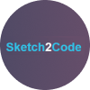

---
nav:
  title: AI 导航
  order: -1
group:
  title: AI 导航
  order: 0
---

# 编程工具

<List>
  <a href="https://github.com/features/copilot" style="display:flex; align-items:center;">
    
    

      
GitHub Copilot

      
GitHub AI编程工具

    

  </a>
  <a href="https://aws.amazon.com/codewhisperer/" style="display:flex; align-items:center;">
    
    

      
CodeWhisperer

      
亚马逊最新发布的免费AI编程助手

    

  </a>
  <a href="https://about.sourcegraph.com/cody" style="display:flex; align-items:center;">
    
    

      
Cody

      
Sourcegraph推出的免费AI编程工具

    

  </a>
  <a href="https://www.useblackbox.io/" style="display:flex; align-items:center;">
    
    

      
BLACKBOX AI

      
黑箱AI编程助理，快速代码生成

    

  </a>
  <a href="https://www.codeium.com/" style="display:flex; align-items:center;">
    
    

      
Codeium

      
AI代码生成和补全

    

  </a>
  <a href="https://sketch2code.azurewebsites.net/" style="display:flex; align-items:center;">
    
    

      
Sketch2Code

      
微软AI Lab推出的将手绘草图转换成HTML代码工具

    

  </a>
  <a href="https://www.codium.ai/" style="display:flex; align-items:center;">
    
    

      
CodiumAI

      
AI代码测试工具

    

  </a>
  <a href="https://www.cursor.so/" style="display:flex; align-items:center;">
    
    

      
Cursor

      
AI编程和软件开发

    

  </a>
  <a href="https://tongyi.aliyun.com/lingma/" style="display:flex; align-items:center;">
    
    

      
通义灵码

      
基于通义大模型的智能编程辅助工具

    

  </a>
  <a href="https://codefuse.alipay.com/" style="display:flex; align-items:center;">
    
    

      
CodeFuse

      
蚂蚁集团推出的AI代码编程助手

    

  </a>
  <a href="https://iflycode.xfyun.cn/" style="display:flex; align-items:center;">
    
    

      
iFlyCode

      
科大讯飞推出的智能编程助手

    

  </a>
  <a href="https://comate.baidu.com/" style="display:flex; align-items:center;">
    
    

      
Comate

      
百度推出的AI编程助手，基于文心大模型

    

  </a>
  <a href="https://www.huaweicloud.com/lab/paas/codeartssnap.html" style="display:flex; align-items:center;">
    
    

      
CodeArts Snap

      
华为云推出的智能编程助手

    

  </a>
  <a href="https://www.askcodi.com/" style="display:flex; align-items:center;">
    
    

      
AskCodi

      
你的个人AI编程助手

    

  </a>
  <a href="https://v0.dev/" style="display:flex; align-items:center;">
    
    

      
v0.dev

      
AI生成前端React/UI组件，由Vercel推出

    

  </a>
  <a href="https://codegeex.cn/zh-CN" style="display:flex; align-items:center;">
    
    

      
CodeGeex

      
国内团队开发的免费AI编程助手

    

  </a>
  <a href="https://codesandbox.io/blog/meet-boxy-ai-coding-assistant" style="display:flex; align-items:center;">
    
    

      
Boxy

      
CodeSandbox推出的AI编程助手

    

  </a>
  <a href="https://www.quest.ai/" style="display:flex; align-items:center;">
    
    

      
Quest AI

      
AI将设计稿生成React代码，支持JavaScript和TypeScript

    

  </a>
  <a href="https://sky-code.singularity-ai.com/index.html#/" style="display:flex; align-items:center;">
    
    

      
天工智码Skycode

      
AI智能编程助手，轻松生成各种代码

    

  </a>
  <a href="https://jam.dev/jamgpt" style="display:flex; align-items:center;">
    
    

      
JamGPT

      
AI Debug调试助手

    

  </a>
  <a href="https://www.aixcoder.com/" style="display:flex; align-items:center;">
    
    

      
aiXcoder

      
自然语言到代码的方法级代码生成，以及多行智能代码补全

    

  </a>
  <a href="https://www.airops.com/" style="display:flex; align-items:center;">
    
    

      
AirOps

      
AI SQL语句生成和修改

    

  </a>
  <a href="https://www.imgcook.com/" style="display:flex; align-items:center;">
    
    

      
Imgcook

      
阿里推出的免费设计稿智能生成前端代码

    

  </a>
  <a href="https://ling-deco.jd.com/" style="display:flex; align-items:center;">
    
    

      
Deco

      
京东推出的设计稿一键生成多端代码工具

    

  </a>
  <a href="https://replit.com/site/ghostwriter" style="display:flex; align-items:center;">
    
    

      
Ghostwriter

      
知名在线编程IDE Replit推出的AI编程助手

    

  </a>
  <a href="https://www.codiga.io/" style="display:flex; align-items:center;">
    
    

      
Codiga

      
AI代码实时分析

    

  </a>
  <a href="https://www.locofy.ai/" style="display:flex; align-items:center;">
    
    

      
Locofy

      
AI无代码工具将Figma、Adobe XD和Sketch设计转换成前端代码

    

  </a>
  <a href="https://fronty.com/" style="display:flex; align-items:center;">
    
    

      
Fronty

      
AI智能将图片转换成HTML和CSS代码

    

  </a>
  <a href="https://www.marsx.dev/" style="display:flex; align-items:center;">
    
    

      
MarsX

      
AI无代码软件开发

    

  </a>
  <a href="https://www.tabnine.com/" style="display:flex; align-items:center;">
    
    

      
Tabnine

      
AI代码自动补全编程助手

    

  </a>
  <a href="https://mutable.ai/" style="display:flex; align-items:center;">
    
    

      
Mutable AI

      
人工智能加速软件开发

    

  </a>
  <a href="https://debuild.app/" style="display:flex; align-items:center;">
    
    

      
Debuild

      
低代码快速开发网页应用

    

  </a>
  <a href="https://www.warp.dev/" style="display:flex; align-items:center;">
    
    

      
Warp

      
21世纪的终端工具（内置AI命令搜索）

    

  </a>
  <a href="https://fig.io/" style="display:flex; align-items:center;">
    
    

      
Fig

      
下一代命令行工具（内置AI终端命令自动补全）

    

  </a>
  <a href="https://codesnippets.ai/" style="display:flex; align-items:center;">
    
    

      
CodeSnippets

      
AI代码生成、补全、分析、重构和调试

    

  </a>
  <a href="https://hocoos.com/" style="display:flex; align-items:center;">
    
    

      
Hocoos

      
无代码AI智能在线快速创建网站

    

  </a>
  <a href="https://httpie.io/ai" style="display:flex; align-items:center;">
    
    

      
HTTPie AI

      
AI API开发工具

    

  </a>
  <a href="https://ai-code-reviewer.com/" style="display:flex; align-items:center;">
    
    

      
AI Code Reviewer

      
AI代码检查

    

  </a>
  <a href="https://visualstudio.microsoft.com/zh-hans/services/intellicode/" style="display:flex; align-items:center;">
    
    

      
Visual Studio IntelliCode

      
Visual Studio AI辅助开发

    

  </a>
  <a href="https://www.heycli.com/" style="display:flex; align-items:center;">
    
    

      
HeyCLI

      
自然语言转义为CLI命令

    

  </a>
</List>
